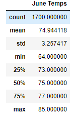
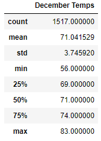
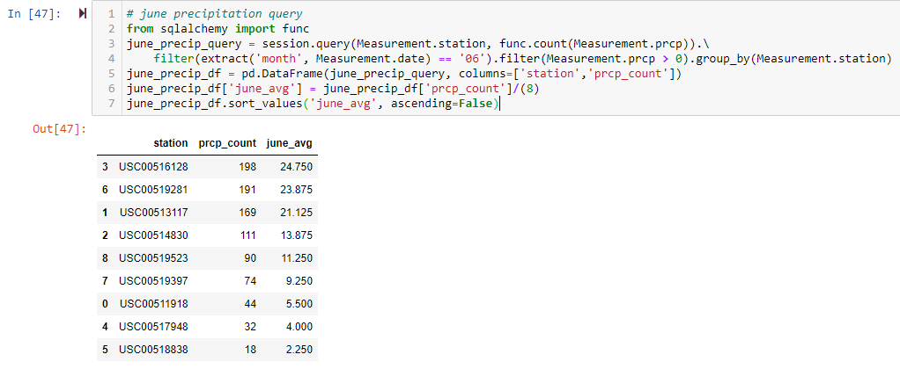
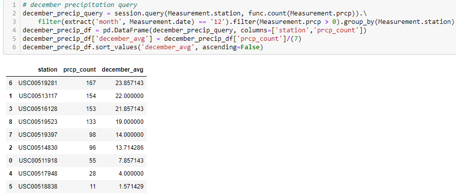

# Surfs-Up Challenge

## Project Overview
An analysis of the weather was conducted given a SQLite database containing precipitation and temperatures for various stations during 2010-2017. Specifically, an analysis of temperature trends was conducted for the months of June and December in Oahu, Hawaii to determine if the surf and ice-cream shop business is sustainable year-round. 

## Results

- There are approximately 200 more temperature observations in June than in December. 
- The difference in average temperature between June (74.94°F) and December (71.04°F) is approximately 4°F. Additionally, the difference between the Q1, Q2, and Q3 of June and December temperatures are also approximately 4°F.
- The difference in minimum temperature June (64.0°F) and December (56.0°F) is 8°F. 

## Summary
In reference to each bullet point above:
- Since there are more data for June than there are in December, more temperature data could provide a better analysis of temperature statistics. Perhaps gathering additional years of data for December could provide even more representative results.
- The difference in temperature between June and December will play a role. The warmer the temperature, the more likely someone is to visit an ice-cream and surf shop. However, the actual temperature between the two does not vary significantly. It will depend on what temperature range in which people more inclined to consume ice-cream and/or purchase items from a surf shop.
- The difference in minimum temperature also plays a role. This will play a major decision factor in whether the ice-cream and surf shop is sustainable since the lower the temperature, the less likely someone is inclined to consume ice-cream and/or purchase items from a surf shop. Again, it will come down to temperature preferences and, perhaps, cold temperature tolerance. 

The current analysis only considered temperatures. The other meteorological phenomena is precipitation, in the form of rain. When the weather calls for rain, people are most likely less inclined to go to an ice-cream shop and/or visit a surf shop. The total precipitation may be a good indicator for sustainability. However, the number of days with precipitation is probably a better indicator for sustainability (assuming that if rain was observed on any single day, then a decrease in ice-cream and surf shop sales would occur for that day compared to a day without precipitation). 

To provide a better analysis of whether opening up an ice-cream and surf shop is sustainable in Oahu, two queries (one for June and one for December) were created where: queried the station ID and precipitation count where the month was either for June or December, precipitation greater than 0 (also tried including an and precipitation not equal to "NaN", which produced the same results so it was not added), group by the station ID. A dataframe was created based on the results from the query. A new column was added to the dataframe based on the count divided 8 for June and 7 for December (number of years between 2010-2017; 2017 data only went up to August) to determine the average monthly days of precipitation. Lastly, the dataframe was sorted based on the average monthly days of precipitation from greatest to smallest. 
Based on these results, there are certain stations (areas) where it may not be sustainable to open up an ice-cream and surf shop. For the most sustainable areas, it is recommended to open up shop in areas where the average monthly days of precipitation is small (such as USC00511918, USC00517948, and/or USC00518838).

